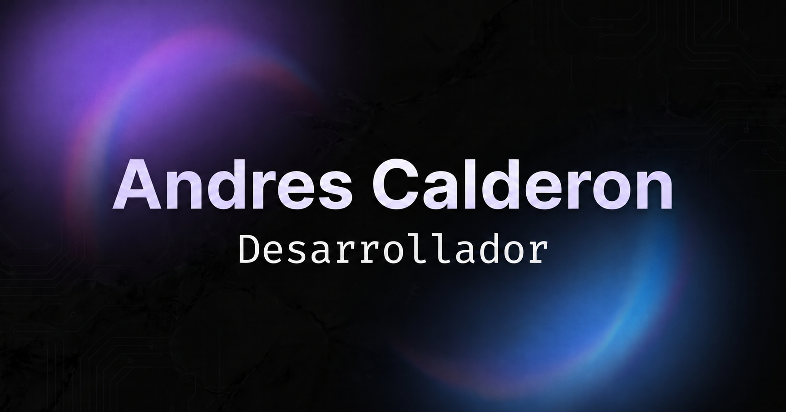

# Andres Alejandro Calderon Vertiz
### Desarrollador Fullstack | Diseñador UI/UX | Arquitecto de Software

## Perfil Profesional
Desarrollador Fullstack especializado en construir aplicaciones web y móviles de alto rendimiento, seguras y escalables. Apasionado por la optimización de código, la arquitectura limpia y el desarrollo de sistemas robustos ante vulnerabilidades bajo el ecosistema open source.

* **Estado actual:** Disponible para nuevos proyectos o empleo.
* **Ubicación:** La Paz, Bolivia.
* **Idiomas:** Español, Inglés.

---

## Experiencia y Proyectos Destacados

### Sector Gubernamental

* **Ecosistema SEÑABOL (Ministerio de Educación)**
    * *Descripción:* Diseño e ingeniería de un sistema informático integralizado para el aprendizaje, gestión académica y estandarización de la Lengua de Señas Boliviana (LSB). Desarrollado para mitigar la fragmentación lingüística mediante una arquitectura distribuida de alta disponibilidad. Integra aplicaciones web, móviles y modelos de aprendizaje supervisado (Inteligencia Artificial) para accesibilidad inclusiva.
    * *Stack:* React, Astro, Python, FastAPI, Tailwind, Kotlin, Jetpack Compose, NestJs, VueJs.

* **Plataforma EDUEVENTOS (Ministerio de Educación)**
    * *Descripción:* Co-desarrollo de una plataforma distribuida para la gestión integral de eventos institucionales del Estado, optimizando los procesos de acreditación, control de asistencia en tiempo real y emisión automatizada de certificaciones mediante una arquitectura acoplada web y móvil.
    * *Stack:* Astro, Tailwind, NestJs, VueJs, Kotlin.

### Sector Comercial

* **Sistema Agenda Estudiantil (ZonaFacil)**
    * *Descripción:* Desarrollo y optimización de una plataforma multirrol orientada a la gestión del tiempo y canales de comunicación síncronos entre estudiantes, tutores, docentes y personal administrativo.
    * *Stack:* Flutter, Laravel.

---

## Stack Tecnológico

<table border="0">
  <tr>
    <td valign="top" width="33%">
      <strong>Frontend & Mobile</strong> 
      • Astro / React / Vue.js 3 / Angular 
      • Tailwind CSS / Bootstrap 5 / Vuetify 
      • Kotlin / Jetpack Compose / Flutter
    </td>
    <td valign="top" width="33%">
      <strong>Backend & Core</strong> 
      • Node.js / NestJS 
      • Python / FastAPI 
      • PHP / Laravel
    </td>
    <td valign="top" width="33%">
      <strong>Infraestructura & Datos</strong> 
      • MySQL / PostgreSQL / MongoDB 
      • Servidores Linux / Bash 
      • Ciberseguridad / Git
    </td>
  </tr>
</table>

---

## Core de Investigación (Proyectos Personales)

* **Algorithmic Trading Bot (Scalping):** Ingeniería de un bot de trading algorítmico automatizado integrado con la API de Binance y monitoreo remoto vía Telegram. Ejecuta seguimiento de order books en tiempo real bajo estrategias de alta frecuencia.
* **Media Background Remover Web:** Aplicación web de procesamiento de imágenes y video en tiempo real mediante la manipulación directa del elemento Canvas HTML5 para aislamiento de capas por software.
* **Gesture-Controlled Slider:** Software de escritorio para presentaciones interactivas basado en Visión por Computadora, integrando modelos de TensorFlow para el tracking de manos en tiempo real.

---

## Estadísticas de Actividad

Para mantener un perfil sobrio, la visualización se encuentra configurada en modo oscuro de alta fidelidad:

---

## Contacto Profesional

Si buscas un perfil fullstack orientado al rendimiento arquitectónico o deseas discutir soluciones de software de misión crítica, puedes iniciar comunicación a través del siguiente correo:

* **Correo Electrónico:** acalderonv14@gmail.com
